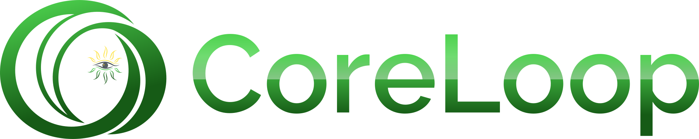

#### Data elements and functionality for various protocols and systems, sometimes used with [Verifiable](https://github.com/Lumoin/Verifiable) for digital signature and other protocols.

## Features

- Implements [United Nations Transparency Protocol (UNTP)](https://uncefact.github.io/spec-untp/)

| Library         | NuGet   |
|---------------- | :------:|
| CoreLoop.UNTransparencyProtocol | 

### Quickly about practicalities

Please, open an issue if you have a suggestion, improvement (e.g. even fixing a typo) or something in mind that could be useful and worth considering.

Pressing **.** on keyboard on this repository page or when viewing any file to open this codebase in VS Code web editor is also a good way to get a feel of the code.

Otherwise the usual things about forking and sending pull requests work too. :)

#### This is an early version under development. All will be breaking.

CoreLoop's primary goal is to define and map data entities from various protocols, sustainability frameworks, and regulatory standards into workable code. This enables the development of dependable software systems that empower businesses and individuals to co-create sustainable, resilient, and accountable systems for a better future.

Examples of these data entities and protocols include the [United Nations Transparency Protocol (UNTP)](https://uncefact.github.io/spec-untp/) and potentially frameworks such as the EU CSRS, both modeled within CoreLoop to facilitate transparent and responsible pathways for supply chain management and project finance.

CoreLoop is designed to work with [Verifiable](https://github.com/Lumoin/Verifiable).

#### Quick links

- [United Nations Transparency Protocol (UNTP)](https://uncefact.github.io/spec-untp/)
- [Verifiable](https://github.com/Lumoin/Verifiable/)

## The design principles

- **Agnostic to serialization and deserialization library.** The design principles for the data entities do not rely on specific deserialization and serialization (e.g. no library specific attributes on types) libraries.
- **Data oriented programming**. Or leaning towards it. The code is structured around the idea of parameters going in functions and results from return values. Or in more length: code is separate from (immutable) data, leaning generic data structures and general-purpose functions (extension methods and static methods).
- **Developer experience**. Writing against an evolving specification or some specific specifications can be difficult. It takes time to learn. So code should link in comments to W3C and RFCs where appropriate (see code for examples).
- **Tests and tests that use real data**. There should be as much tests as possible. Also tests that use as test vectors data from other implementations to cross-check.>

## Vulnerability disclosure

If you find a vulnerability in this project please let us know as soon as possibly. For secure disclosure, please see the [security policy](.github/SECURITY.md).

## Contributing

Please, read [contribution guidelines](.github/contributing.md) for technicalities.

For development, the code and project should run on Windows, Linux and MacOS. Some hardware specific elements may work on only some operating systems.

Taking something from contribution guide and adding specific ideas.

### The usual things :)

:eyes: Please, do write issues.

:raised_hands: By all means, do create pull requests (see [contribution guidelines](.github/contributing.md)).

:star: Stars are always nice. :)

### The code things

:white_check_mark: Adding tests is really good, of course.

:thought_balloon: Issue templates and other improvements to project.

:rocket: improve continuous integration automation is always good!
